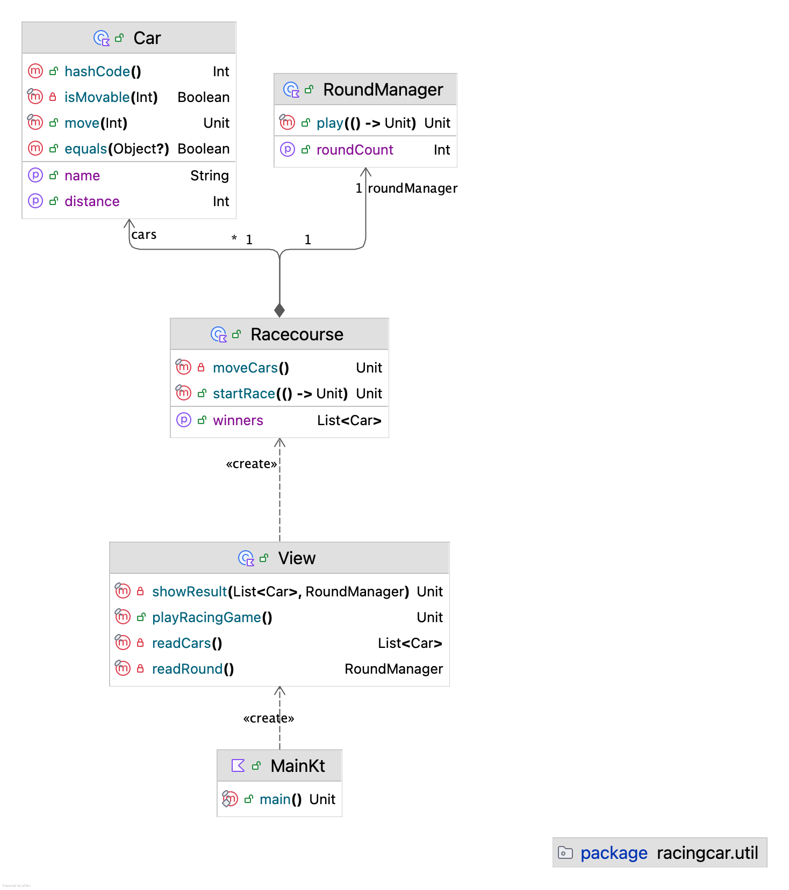

# kotlin-racingcar

자동차 경주

## 프로그램 진행 순서도

1. 경주할 자동차 이름을 요구하는 안내문을 출력한다.
2. 사용자가 경주할 자동차 이름을 입력한다.
3. 시도할 횟수를 요구하는 안내문을 출력한다.
4. 사용자가 시도할 횟수를 입력한다.
5. 자동차 경주를 수행한다.
6. 실행 결과를 출력한다.

### 자동차 경주 알고리즘

1. 사용자의 입력에 따라서 자동차를 만들어서 List 자료구조에 담는다.
2. 조건에 맞는 자동차들이 전진한다.
3. 2번 과정을 시도할 횟수만큼 반복하며 각 과정을 출력한다.
4. 자동차 경주의 최종 우승자를 정한다.
    - 이 때, 자동차가 갖고 있는 전진한 횟수(프로퍼티)를 뽑고, 그만큼의 전진 횟수를 가진 자동차만을 List에 남긴다.
    - `filter()` 메서드 사용
5. 자동차 경주의 최종 우승자 이름을 출력한다.

### 자동차 클래스 Car 설계

사용자가 입력한 것을 바탕으로 만든 하나의 경주 자동차

- 메서드만 노출하는 것을 목표로 설계한다.

1. 자동차 이름을 얻는 메서드
2. 전진하는 메서드
    1. 전진 여부 결정
    2. 전진한 횟수 카운트 업

### 자동차 이름의 유효성 검사를 어디에서 할 것인가?

- 입력 받을 때
- 자동차 클래스를 생성할 때

**채택 방안: 입력 받을 때**  
사유: 가장 간편하게 구현할 수 있을 것 같음

### Racecourse 설계

경주 자동차들을 관리하고 게임을 시작하는 경주장

**기능 목록**

- `Racecourse.startRace()`
- `Racecourse.finalWinners`

### Class Diagram

